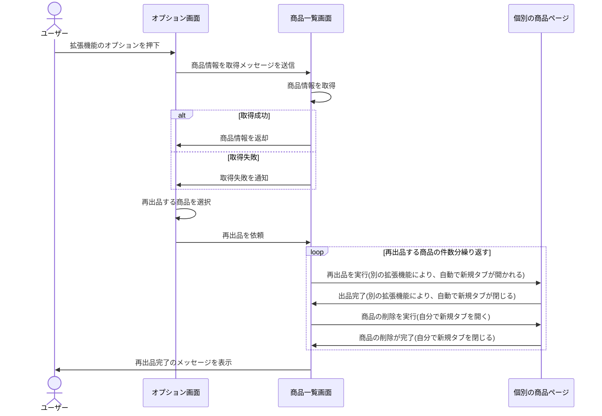

```mermaid
sequenceDiagram
    actor ユーザー
    participant オプション画面
    participant 商品一覧画面
    participant 個別の商品ページ

    ユーザー ->> オプション画面: 拡張機能のオプションを押下
    オプション画面 ->> 商品一覧画面: 商品情報を取得メッセージを送信
    商品一覧画面 ->> 商品一覧画面: 商品情報を取得
    alt 取得成功
        商品一覧画面 ->> オプション画面: 商品情報を返却
    else 取得失敗
        商品一覧画面 ->> オプション画面: 取得失敗を通知
    end
    オプション画面 ->> オプション画面: 再出品する商品を選択
    オプション画面 ->> 商品一覧画面: 再出品を依頼
    loop 再出品する商品の件数分繰り返す
        商品一覧画面 ->> 個別の商品ページ: 再出品を実行(別の拡張機能により、自動で新規タブが開かれる)
        個別の商品ページ ->> 商品一覧画面: 出品完了(別の拡張機能により、自動で新規タブが閉じる)
        商品一覧画面 ->> 個別の商品ページ: 商品の削除を実行(自分で新規タブを開く)
        個別の商品ページ ->> 商品一覧画面: 商品の削除が完了(自分で新規タブを閉じる)
    end
    商品一覧画面 ->> ユーザー: 再出品完了のメッセージを表示
```
